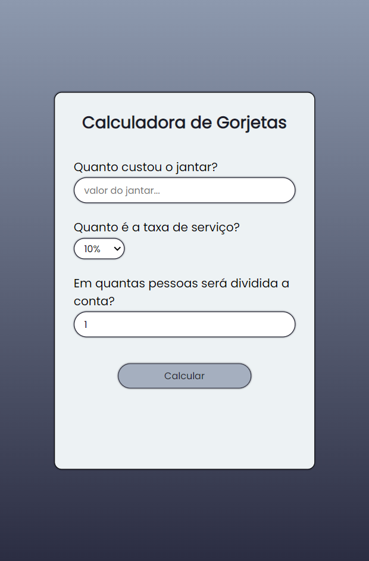

<h1 align="center">Calculadora de gorjetas 💸</h1>
<h4 align="center">Projeto de uma calculadora, que faz a soma da conta do jantar com a taxa de serviço e divide pelo número de pessoas</h4>
<h4 align="center">Feito com HTML, CSS e JavaScript</h4>

&#xa0;

**
Sumário
**

<a href="#dart-sobre">Sobre</a> &#xa0; | &#xa0;
<a href="#white_check_mark-funcionalidades">Funcionalidades</a> &#xa0; | &#xa0;
<a href="#computer-tecnologias">Tecnologias</a> &#xa0; | &#xa0;
<a href="#hammer_and_wrench-serviços">Serviços</a>

<a href="#camera-imagens">Imagens</a> &#xa0; | &#xa0;
<a href="#orange_book-como-usar">Como usar</a> &#xa0; | &#xa0;
<a href="#scroll-pré-requisitos">Pré-requisitos</a> &#xa0; | &#xa0;
<a href="#link-links">Links</a> &#xa0; | &#xa0;
<a href="#sparkles-autor">Autor</a>

 &#xa0;
 
## :dart: Sobre

Esse projeto foi criado no intuito de ajudar as pessoas na hora de somar e dividir a conta de um jantar ou algo do tipo.

Consiste em somar o valor da conta com a taxa de serviço, e ainda divide pelo número de pessoas que irão arcar com a despesa.

&#xa0;

## :white_check_mark: Funcionalidades
As principais funcionalidades do projeto são:

✔️ Permitir selecionar o valor da taxa de serviço (5%, 10%, 15%, 20%);

✔️ Somar a conta com a taxa de serviço escolhida;

✔️ Dividir o total da conta com o número de pessoas;

✔️ Responsivo em qualquer tamanho de tela.

&#xa0;

## :computer: Tecnologias
* [HTML](https://developer.mozilla.org/pt-BR/docs/Web/HTML)

* [CSS](https://developer.mozilla.org/pt-BR/docs/Web/CSS)

* [JavaScript](https://www.javascript.com/)

&#xa0;

## :hammer_and_wrench: Serviços
* <a href="https://github.com/">GitHub</a>

* <a href="https://www.netlify.com/">Netlify </a>- hospedagem

* <a href="https://fonts.google.com/">Google Fonts </a>- importação da fonte

&#xa0;

## :camera: Imagens
**
Exemplo de funcionamento:
**

  

**
Captura de tela da calculadora:
**

  

&#xa0;

## :orange_book: Como usar

Para usar, abra a página com o link do deploy para ser direcionado para a calculadora.

Preencha os campos com o valor do jantar, o número de pessoas para dividir a conta e selecione a taxa de serviço. Ao concluir, clique no botão "Calcular" e pronto! o valor por pessoa já será exibido!

&#xa0;

## :scroll: Pré requisitos
Para utilizar o sistema, basta um navegador de sua preferência e conexão com internet.

&#xa0;

## :link: Links
* Repositório: https://github.com/CaioAugustoHD/Calculadora-gorjetas
* Deploy: https://calculagorjetas.netlify.app/

&#xa0;

## :sparkles: Autor

<h4>Feito por Caio Augusto Pereira</h4>

&#xa0;

 

