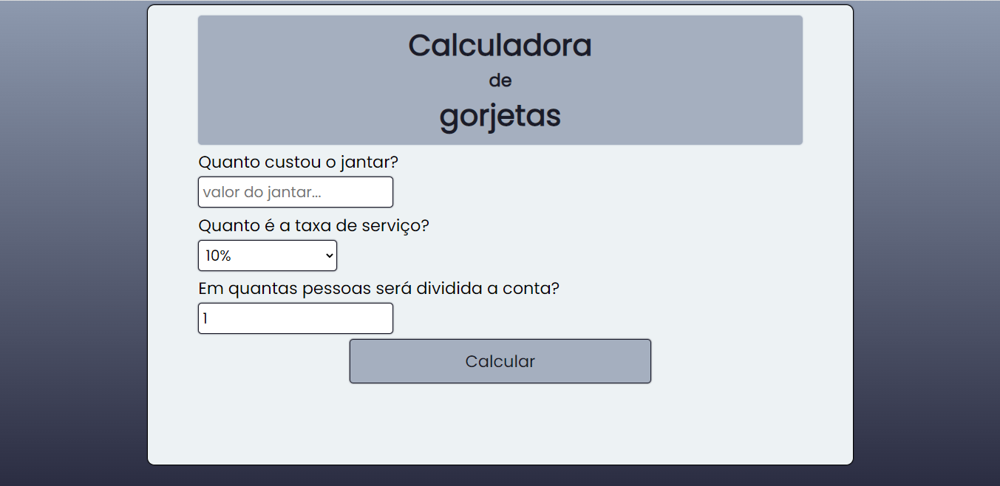
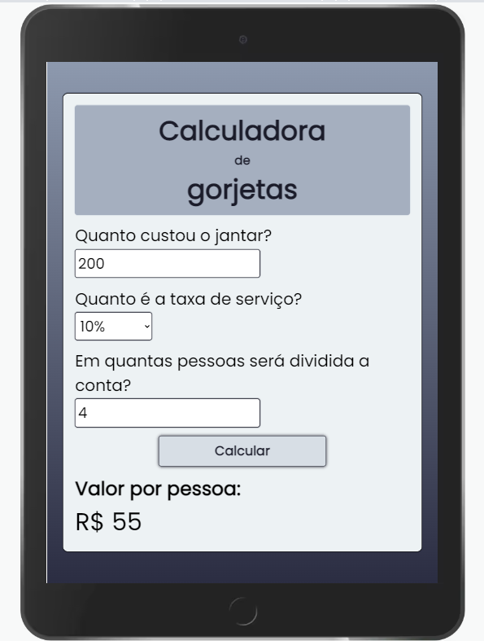
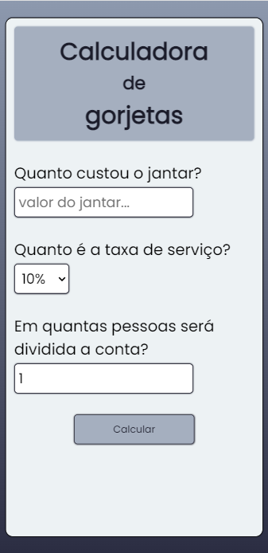

<h1 align="center">Calculadora de gorjetas</h1>

Projeto de uma calculadora, que faz a soma da conta do jantar com a taxa de serviço e divide pelo número de pessoas. Produzido com HTML, CSS e JavaScript.

---

**
Sumário:
**

<a href="#sobre">Sobre</a> |
<a href="#funcionalidades">Funcionalidades</a> |
<a href="#tecnologias">Tecnologias</a> |
<a href="#serviços-usados">Serviços usados</a> |
<a href="#imagens">Imagens</a> |
<a href="#como-usar">Como usar</a> |
<a href="#pré-requisitos">Pré-requisitos</a> |
<a href="#links">Links</a> |
<a href="#autor">Autor</a>

## Sobre
Esse projeto foi criado no intuito de ajudar as pessoas na hora de somar e dividir a conta de um jantar ou algo do tipo. Consiste em somar o valor da conta com a taxa de serviço, e ainda divide pelo número de pessoas que irá arcar com a despesa.

## Funcionalidades
As principais funcionalidades do projeto são:

✅ Poder selecionar qual a taxa de serviço (5%, 10%, 15%, 20%);

✅ Soma da conta com a taxa de serviço escolhida;

✅ Dividir o total da conta com o número de pessoas;

✅ Responsivo em diversos tamanhos de tela.

## Tecnologias
* HTML5
* CSS3
* JavaScript

## Serviços usados
* GitHub
* Netlify (hospedagem do site)

## Imagens

Tela de computador ou notebook:

---

Tela de tablet:

  

---

Tela de smartphone:

  

---

## Como usar
Para usar, abra a página com o link do deploy para ser direcionado para a calculadora. Preencha os campos com o valor do jantar, o número de pessoas para dividir a conta e selecione a taxa de serviço. Após concluir os passos anteriores, clique no botão "Calcular" e pronto! o valor por pessoa já será exibido!

## Pré requisitos
Para abrir a calculadora, basta o uso de um navegador de sua preferência.

## Links
* Deploy: https://calculagorjetas.netlify.app/
* Repositório: https://github.com/CaioAugustoHD/Calculadora-gorjetas

## Autor
✨ Feito por Caio Augusto!!!

* caioaugustosbs@gmail.com
* <a href="https://www.linkedin.com/in/caio-augusto-cap/" target=”_blank”>LinkedIn</a>
* <a href="https://github.com/CaioAugustoHD" target=”_blank”>GitHub</a>
